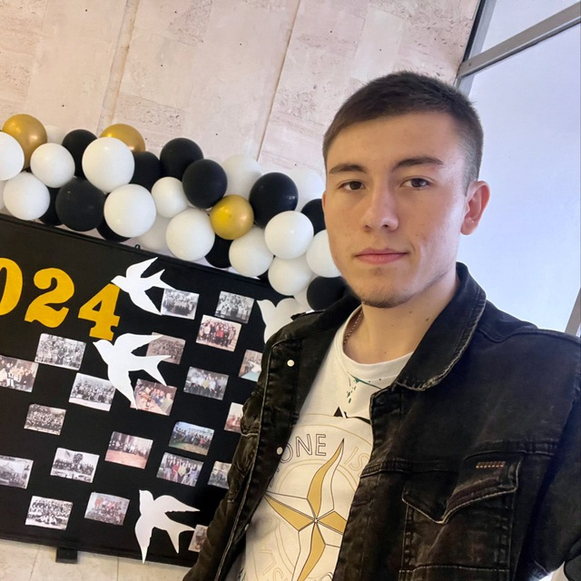

# 👋 Hi there, I’m **Iurii Bogdanov**

🎓 Student at **Moldova State University**, Faculty of Mathematics and Computer Science, Department of Informatics  

---

## 📸 Avatar

---

## 🚀 About Me
I’m **20 years old** and from **Tvardita, Moldova** 🇲🇩.  
Outside of coding, I’m a big ⚪️✨ **Real Madrid** fan, and I enjoy 🎮 video games, ♟️ chess, and checkers.  

People often describe me as **friendly, curious, sociable**, and sometimes a bit **shy**.  
I love to challenge myself with new technologies and improve my problem-solving skills.  

---

## 🎯 Interests
- ⚽ Football  
- 🚗 Driving  
- 💻 Programming  

---

## 🧑‍💻 Programming Skills  

**💬 Languages:**  
Java, C++, Python, C# *(learning)*, PHP *(basic)*  

**🌐 Web Development:**  
HTML, CSS, JavaScript *(basics)*  

**🗄️ Databases:**  
Oracle SQL, MS SQL, PostgreSQL, MySQL  

**⚙️ Tools & Frameworks:**  
IntelliJ IDEA, VS Code, Docker, AWS *(learning)*, JDBC, Spring Boot *(learning)*, Git & GitHub  

---

## 📬 How to Reach Me
- **Email:** [iurcikbogdanov18@gmail.com](mailto:iurcikbogdanov18@gmail.com)  
- **GitHub:** [iurii1801](https://github.com/iurii1801)  
- **Telegram:** [@bogdanov_18i](https://t.me/bogdanov_18i)  
- **Instagram:** [@bogdanov_18_](https://www.instagram.com/bogdanov_18_/)

---

> ⚡ *I believe that writing clean code is like playing chess – it’s all about strategy, foresight, and thinking a few steps ahead.*
